# 📝 Todo JS App – AWS ECS Deployment

A simple **Todo List JavaScript application** containerized with **Docker** and deployed on **AWS ECS** using **Amazon ECR**.  
This project demonstrates a complete **CI-style manual deployment workflow** from EC2 → Docker → ECR → ECS.

---

## 🚀 Project Overview

This project showcases how to:
- Clone and build a JavaScript Todo application
- Containerize the app using Docker
- Push the Docker image to Amazon ECR
- Deploy and run the container using AWS ECS (Task Definition + Cluster)

## 🏗️ Architecture Overview

## ScreenShots
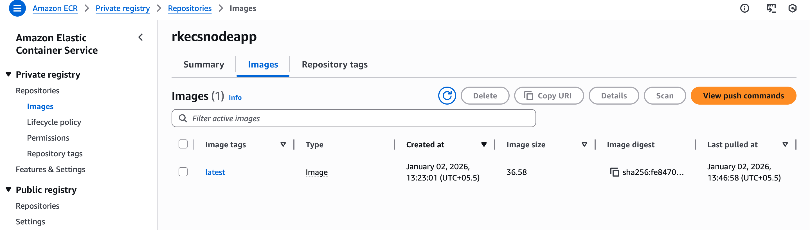 <br>
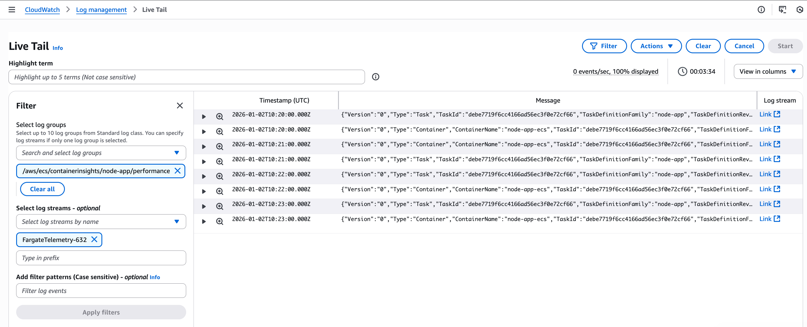 <br>
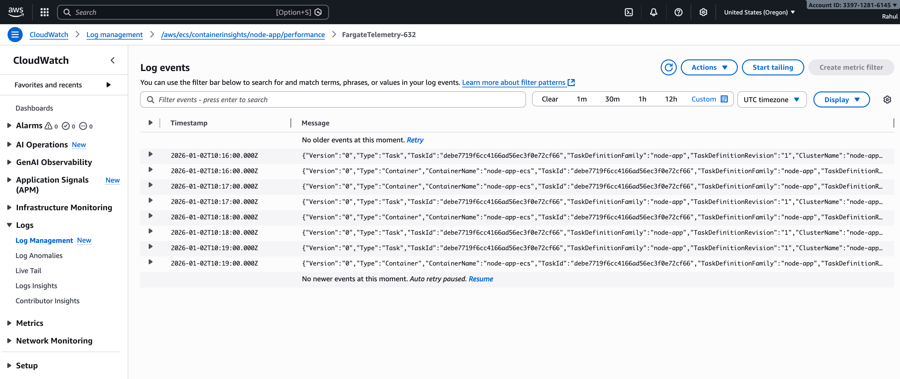 <br>
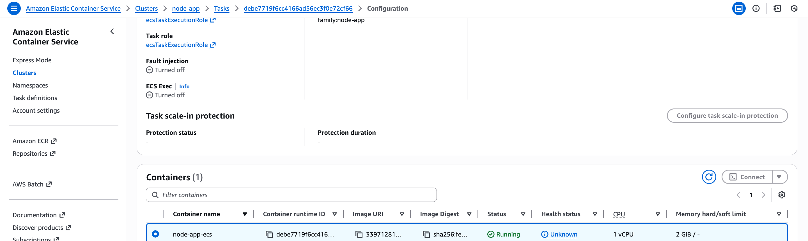 <br>
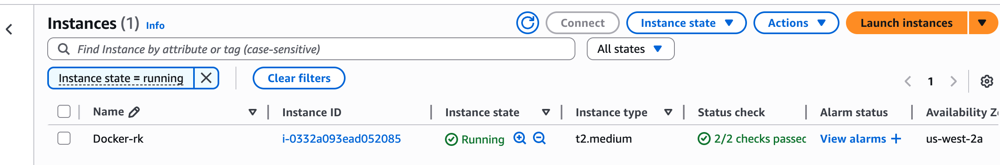 <br>
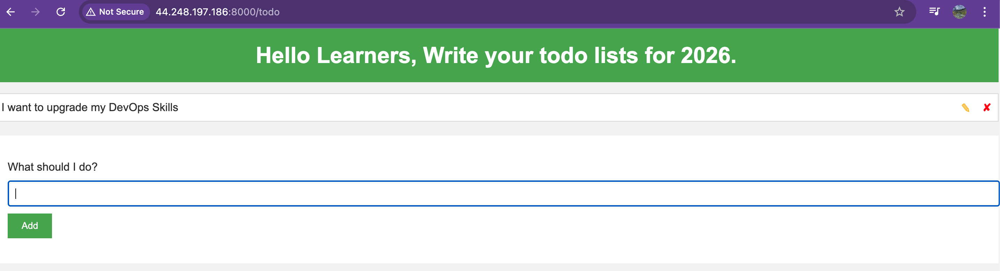 <br>
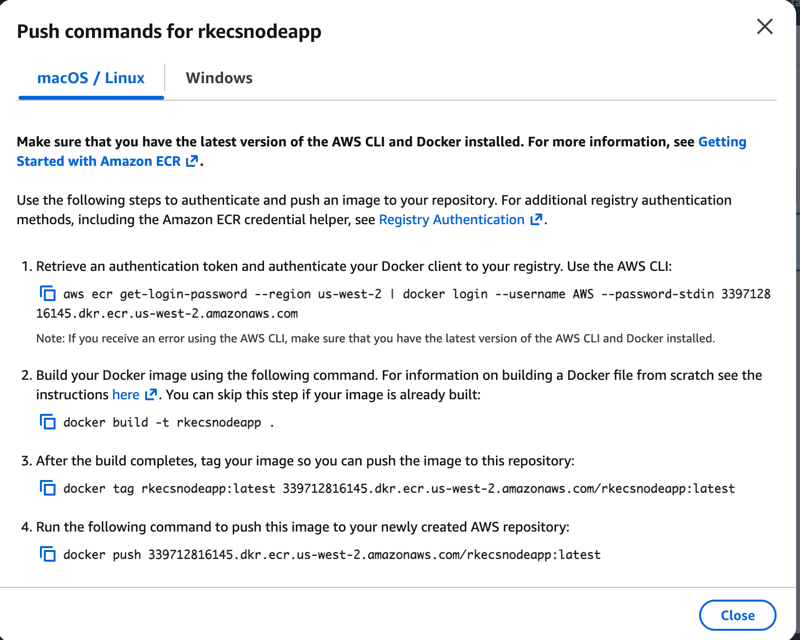 <br>
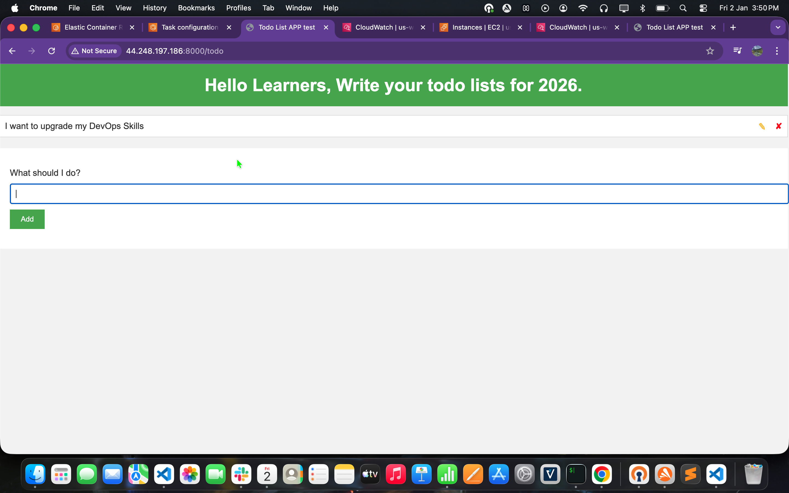 <br>
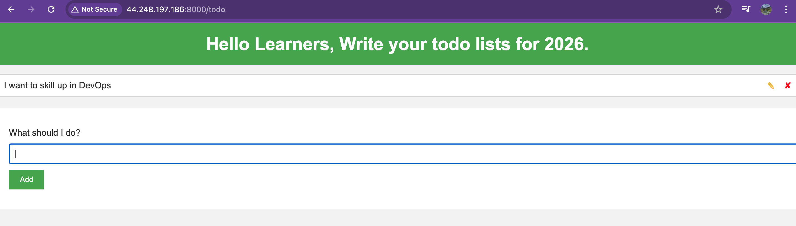 <br>
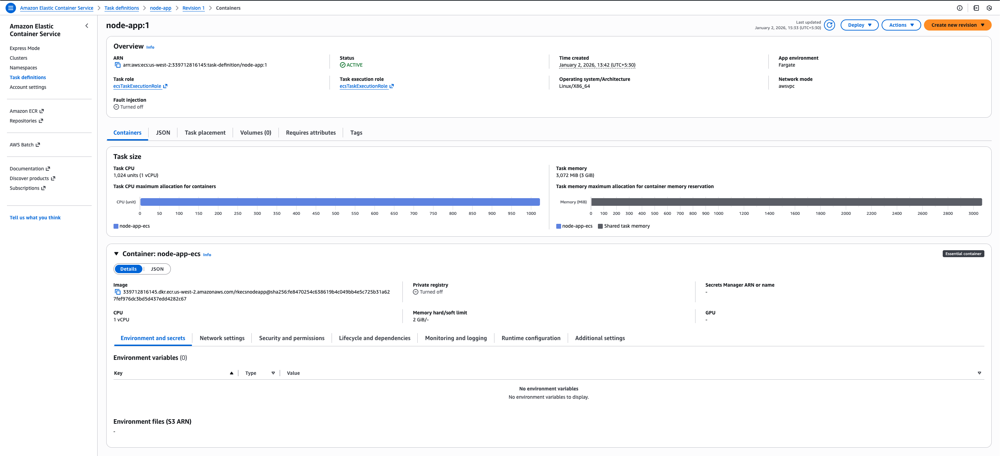 <br>
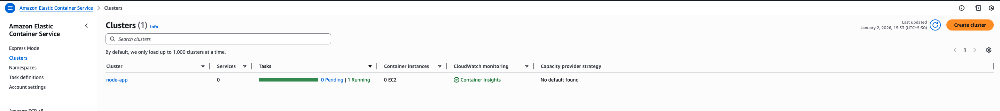 <br>
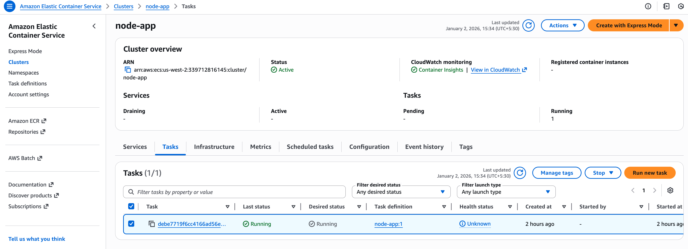 <br>
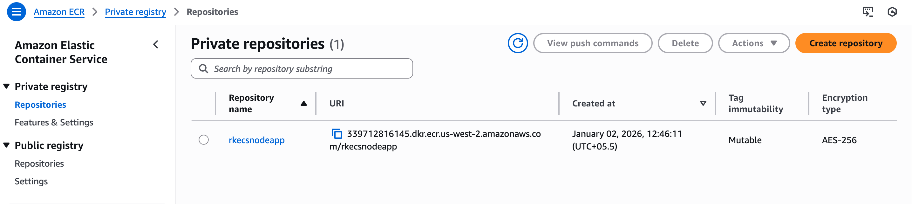 <br>
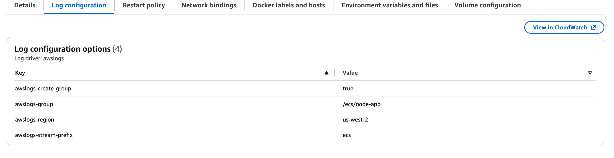 <br>
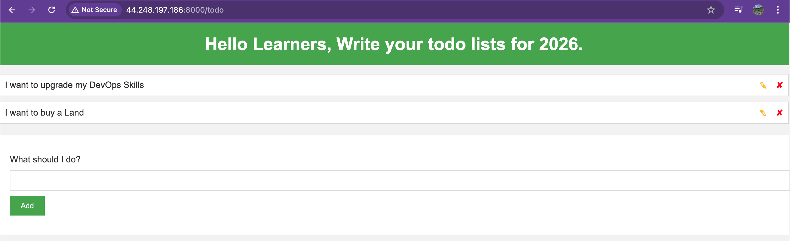 <br>
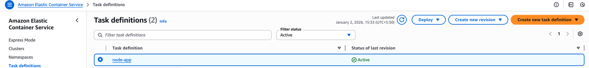 <br>

---------------------------------------------------


```bash 
---

## 🛠 Tech Stack

- **Frontend**: JavaScript (Todo App)
- **Containerization**: Docker
- **Cloud Platform**: AWS
- **Container Registry**: Amazon ECR
- **Container Orchestration**: Amazon ECS (EC2 launch type)
- **Compute**: Amazon EC2
- **OS**: Amazon Linux 2023

---

## 📐 Architecture Flow

GitHub Repo
↓
EC2 Instance
↓
Docker Build
↓
Amazon ECR
↓
ECS Task Definition
↓
ECS Cluster
↓
Running Todo App Container


---

## ⚙️ Setup & Deployment Steps

### 1️⃣ Clone the Repository on EC2
```bash
git clone <your-repo-url>
cd todo-js-app
2️⃣ Build Docker Image

docker build -t todo-js-app .
3️⃣ Authenticate to Amazon ECR

aws ecr get-login-password --region <region> \
| docker login --username AWS --password-stdin <account-id>.dkr.ecr.<region>.amazonaws.com
4️⃣ Tag & Push Image to ECR

docker tag todo-js-app:latest <account-id>.dkr.ecr.<region>.amazonaws.com/todo-js-app:latest
docker push <account-id>.dkr.ecr.<region>.amazonaws.com/todo-js-app:latest
5️⃣ Create ECS Task Definition
Container image from ECR

CPU & memory configured

Port mapping exposed (e.g., 8000)

Log driver enabled (optional)

6️⃣ Run Task on ECS Cluster
Launch ECS cluster (EC2 backed)

Run task using created task definition

Verify container is running successfully

🌐 Application Access
Once the ECS task is running, access the app using:


http://<EC2-Public-IP>:<Exposed-Port> #check security group associated with cluster container ENI

✅ Key Learnings
End-to-end container deployment on AWS

Hands-on with Amazon ECR & ECS

ECS task definitions and cluster management

Real-world DevOps deployment workflow